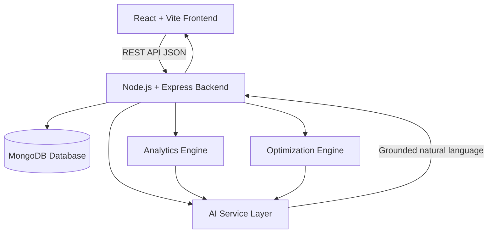
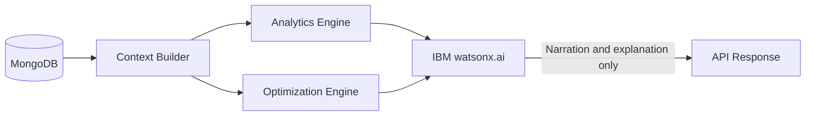
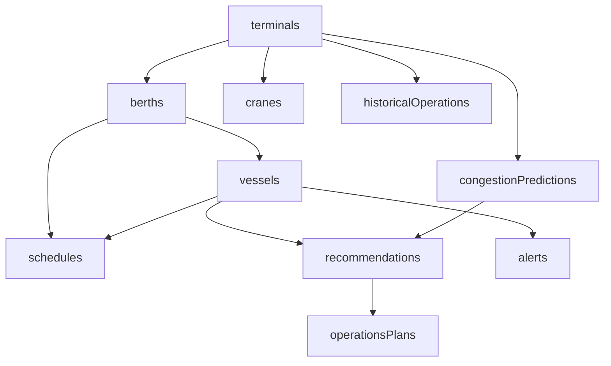

# Architecture

## PortMind AI — System Architecture

### High-Level Architecture



### Component Responsibilities

| Component | Responsibility |
|---|---|
| React Frontend | UI, user interactions, API calls, charts, state management |
| Express Backend | REST API, routing, validation, business logic orchestration |
| MongoDB | Persistent storage for all operational and historical data |
| Analytics Engine | Deterministic congestion scoring, utilization calculation, forecasting |
| Optimization Engine | Berth assignment algorithm, crane allocation, conflict detection |
| AI Service Layer | Context assembly, IBM watsonx.ai client, response grounding |

### AI Architecture



**Key principle:** IBM watsonx.ai only generates natural-language explanations. All operational numbers are computed by deterministic engines before the AI is called.

### Backend Architecture

```
src/backend/src/
├── server.js              — Express app entry point
├── config/
│   ├── database.js        — MongoDB connection
│   └── env.js             — Environment configuration
├── models/                — Mongoose schemas
├── controllers/           — Request handlers
├── routes/                — Route definitions
├── services/              — Business logic + database queries
├── middleware/            — Auth, validation, error handling, logging
├── utils/                 — Logger, response utilities, seed data
├── analytics/             — Congestion scoring, utilization, forecasting
├── optimization/          — Berth optimizer, crane allocator, conflict detector
└── ai/                    — Context builder, watsonx.ai client, system prompts
```

### Database Architecture



**Collections:** terminals, berths, cranes, vessels, schedules, congestionPredictions, recommendations, operationsPlans, alerts, historicalOperations

### Congestion Model

**Analytical Scoring Model** (transparent, not a black-box ML model):

```
congestionScore =
  0.30 × berthUtilizationFactor
+ 0.25 × vesselQueueFactor
+ 0.20 × arrivalRateFactor
+ 0.15 × craneShortfallFactor
+ 0.10 × largeVesselFactor

Thresholds:
  < 0.35  →  LOW
  < 0.60  →  MEDIUM
  < 0.80  →  HIGH
  >= 0.80 →  CRITICAL
```

### Security Considerations

- Demo credentials documented in `.env.example` (not hardcoded in source)
- JWT structure in place for authentication extension
- `.env` files excluded from git via `.gitignore`
- Helmet middleware for HTTP security headers
- CORS configured to allow only frontend origin
- Input validation on all mutation endpoints
- Error messages do not expose stack traces in production

### Scalability Considerations

- MongoDB indexes on frequently queried fields (terminalId, arrivalTime, status)
- Paginated vessel and schedule list endpoints
- Analytics engine designed as stateless functions (horizontally scalable)
- AI context builder limits payload size to prevent token overflow
- Frontend chart data limited to meaningful time windows

---

*PortMind AI — IBM Bob AI Hackathon 2026*
